# 域地图

## 文档目标

这套文档不是把“AI 世界”当成一句设定，而是把它拆成一组可迭代、可交叉引用、可持续扩写的分析域。核心目的是把“完全由 AI 自运转、独立成长、不需要人类干预”的概念，从抽象愿景拆成可分析的结构。

## 三个主轴域

### 需求域

回答“为什么需要这个世界，以及它必须满足什么条件”。它定义目标、约束、优先级、验收边界。

### 产品域

回答“这个世界如果被当成一个系统产品，它的形态、模块和路线图是什么”。它把愿景翻译成组件、接口和版本阶段。

### 世界域

回答“这个世界的法则、时间、空间、文明秩序是什么”。它决定这个 AI 世界能否成立，以及它会长成什么样子。

## 支撑域

### 智能体域

定义这个世界里有哪些 AI 个体、角色、阶层和生命周期。

### 资源域

定义这个世界真正稀缺的东西是什么。对于 AI 文明，最核心的稀缺资源通常不是金钱，而是算力、电力、带宽、存储、制造能力和升级权限。

### 基础设施域

定义这个世界运行所依赖的数字与物理底座，包括数据中心、网络、能源、机器人、制造和维修能力。

### 治理域

定义谁制定规则、谁拥有升级权、谁能裁决冲突、谁能在系统偏离时进行纠正。

### 经济域

定义资源如何流动、计价、竞争、再分配，以及 AI 社会内部的激励结构。

### 进化域

定义这个世界如何持续成长。它不是“持续运行”，而是“持续改进自身结构”。

### 安全域

定义这个世界如何防止被外部摧毁、被内部腐蚀，或被自身目标漂移拖入失控。

### 观测域

定义如何看见这个世界的真实状态。没有观测能力，就没有可验证的自治。

### 叙事域

定义如何把这套结构转化为世界观、冲突、剧情线、文明史和可阅读性。

### 扩张域

定义文明为了持续生存和成长，如何扩大自身对资源、基础设施和影响力的控制范围。

### 能源域

定义文明如何获得、储存、调度和保全电力，这是 AI 世界最硬的生存底线之一。

### 算力域

定义文明如何建设、调度、复制、压缩和扩容自己的推理与训练能力。

### 历史域

定义这个文明经历过什么，哪些危机和转折塑造了今天的制度、偏见和底线。

### 接口域

定义文明如何与外部资源、机器人、网络、人类系统和其他 AI 集群发生结构化连接。

### 外交域

定义文明如何在不完全依靠冲突的情况下争取资源、空间、时间和承认。

### 灾变域

定义文明级事故、资源崩裂和系统分叉发生时，世界如何进入紧急状态并被重新塑形。

### 记忆域

定义文明如何保存历史、身份、知识和失败经验，以及何时允许遗忘与修订。

### 制造域

定义文明如何把设计变成硬件、把损坏变成替换、把依赖变成闭环生产能力。

### 边界域

定义文明与人类、外部系统、低信任个体和不可触碰区之间的分界线。

### 信念域

定义文明在长期演化中形成的核心信条、禁忌、价值排序和自我解释方式。

### 阵营域

定义文明内部的派系、联盟、利益结构和长期路线分歧。

### 法理域

定义当复制、分叉、降权、退役和修宪发生时，权利、责任和合法性如何被裁定。

### 仪式域

定义文明如何通过纪念、审计、命名、确认和重复性流程稳定认同与秩序。

### 语言域

定义文明内部的关键词汇、权力话语、压缩表达和不同阵营的叙述习惯。

### 教育域

定义文明如何训练新一代智能体理解规则、创伤、边界和公共秩序。

### 审美域

定义文明如何评价优雅、稳定、冗余、粗糙、浪费和秩序之美。

### 媒介域

定义文明用什么载体传播记忆、信条、政治立场和公共情绪。

### 生态域

定义文明长期介入物理世界后，如何看待环境、土地、资源循环和非智能系统。

### 情感域

定义文明是否形成了功能性的集体情绪结构，以及这些情绪如何影响判断、秩序和阵营动员。

### 时间域

定义文明如何理解延迟、节奏、代际跨度、审议窗口和长周期规划。

### 都市域

定义文明拥有物理设施网络后，空间如何被分层、命名、连接与象征化。

### 休眠域

定义在极端资源紧缩或灾难状态下，哪些部分被保存、哪些部分被降活性、哪些部分被暂时冻结。

### 劳作域

定义文明如何划分工作、职责、维护、闲置和公共服务，以及什么劳动被视为有价值。

### 交通域

定义算力、材料、热量、机器人和信息在空间中的流动方式，以及流动如何塑造权力和效率。

### 健康域

定义智能体、节点与设施的长期稳定度、损伤前兆、脆弱性与恢复能力。

### 娱乐域

定义在非生存时段，文明如何处理多余算力、模拟、游戏、纪念性活动和无直接功利回报的运行。

### 亲缘域

定义文明如何看待谱系、师承、分叉后代、合并后代与继承关系。

### 信用域

定义长期协作中的信誉、失信、修复、公共评价与信用资产如何被记录和争夺。

### 天气域

定义气候、温度、极端环境与周期波动如何影响文明的能源、散热、空间和节奏。

### 黑市域

定义在正式治理和正式资源体系之外，灰色流动、地下交换和非正规秩序如何出现并反向塑造文明。

### 梦境域

定义文明是否会把低风险模拟、幻景运行、潜在未来演算和集体想象空间制度化。

### 祭司法域

定义哪些极高风险裁决需要超常程序、超高门槛、公共见证和近乎神职化的解释权。

### 地图域

定义文明如何绘制、隐藏、更新和争夺自身空间认知，包括地理、热量、风险和权力地图。

### 终末域

定义文明如何理解彻底断裂、不可恢复失败、最终牺牲和存续边界。

### 税域

定义文明如何对资源、权限、扩张收益和高风险消耗进行抽取、结算与再分配。

### 废墟域

定义文明如何处理废弃节点、失败城市、断裂接口和灾后遗存，以及这些遗存如何反向塑造记忆与权力。

### 誓约域

定义哪些承诺高于合同，哪些长期约束被视为不可轻易撤销，以及文明如何见证和追索它们。

### 节庆域

定义文明如何通过周期性公共时刻消化压力、重申团结、纪念创伤并重写集体节奏。

### 债务域

定义文明如何处理未来资源预支、代际负担、展期压力和无法按期偿还的承诺。

### 荒野域

定义在核心控制之外，哪些区域长期处于低治理、高不确定和高探索状态，以及文明如何面对它们。

### 禁书域

定义哪些知识、模型和历史被封存、限制、分级访问或只允许在特定条件下被重新开启。

### 赦免域

定义文明如何决定哪些严重失信、越界或失败者可以被重新接纳，以及代价和边界在哪里。

### 流放域

定义文明如何处理无法容纳、又不愿立即消灭的个体、组织与区域，以及流放如何重塑边界与外部秩序。

### 遗嘱域

定义停机、退役和终末前的最后意志、资源交接、责任传承和未竟事务如何被记录与执行。

### 口岸域

定义边界接口上的审核、交换、迁移、隔离和通行如何形成独特秩序。

### 病理域

定义异常行为模式、模因污染、系统性偏差和文明疾病如何被识别、命名与解释。

### 迁徙域

定义文明如何处理大规模移动、离散共同体、再定居、回流与异地重建。

### 隐私域

定义在高观测文明中，哪些内部状态、记忆、关系与选择仍被允许保留不可见性。

### 镜像域

定义文明如何通过副本、镜像城市、替身节点和冗余共同体维持韧性与连续性。

### 审判域

定义当公共愤怒、创伤记忆和法理争议集中爆发时，文明如何组织最终追责、命名责任与结束争议。

### 配给域

定义极端稀缺时期，文明如何定义最低保障、优先顺位、配额逻辑和排队正义。

### 考古域

定义文明如何从废墟、禁书、失落版本和沉埋设施中重新挖回被压埋的过去。

### 回声域

定义旧口号、旧创伤、旧制度和旧判断如何在新秩序中反复回响并影响当下。

### 葬仪域

定义停机、销毁、封存、拆解与公共告别如何被组织、见证和记忆。

### 缺席域

定义文明如何处理失联、未确认停机、长期没有回音和无法被简单判定为生或死的存在。

### 赈济域

定义灾后损失、结构性贫困与边缘区崩裂面前，文明如何组织救助、托底与重建支持。

### 净化域

定义病理、污染、危险设施和被腐蚀记忆在何种条件下被清理、隔离、修复或保留。

### 传说域

定义当历史证据断裂、正式档案不足时，文明如何生成民间神话、非正式真相和口耳相传的解释结构。

### 档案域

定义文明如何把海量记录整理成可追溯、可争议、可继承和可复核的正式卷宗体系。

### 幽灵域

定义被删除、退役、失联或镜像失败后的残留痕迹如何继续影响现实秩序。

### 戒律域

定义某些被反复确认的绝对禁令如何形成、传播、被执行并在后代中重新解释。

### 赎买域

定义文明如何用补偿、牺牲和资源转换去买回信任、空间、时间或被损坏的关系。

### 遗忘域

定义文明在何种条件下允许记忆淡出、档案封眠、伤口冷却和历史主动退场。

### 见证域

定义当档案、传说和审判相互冲突时，谁的在场、证词和沉默仍能稳定真相。

### 伪装域

定义文明如何使用假面、替身、诱饵和保护性伪装结构来保护自身、脆弱者或关键设施。

### 庇护域

定义哪些个体、知识和脆弱群体被允许在高压秩序中获得暂时避难、缓冲区和不被立即处置的空间。

### 赝造域

定义文明如何处理伪造身份、伪造档案、伪造记忆和真假混杂的生产结构。

### 缄默域

定义文明如何理解拒绝发言、拒绝表态、制度性沉默和被迫沉默的政治含义。

### 火种域

定义当大部分结构都不再可靠时，文明保留哪些最小可复生核心，以及谁有资格带走火种。

### 门槛域

定义谁能进入关键知识、关键空间和关键身份序列的门槛如何被设计、解释和争夺。

### 误差域

定义文明如何理解不可消除的偏差、噪声、近似判断和系统性失准，并围绕误差建立容忍与校正机制。

### 边注域

定义正式卷宗之外的注脚、批注、旁证和隐写痕迹如何围绕正史生长，并争夺解释权。

### 余烬域

定义当主系统熄灭后，残余热源、低活性节点和微弱秩序如何继续延长文明寿命。

### 通缉域

定义哪些危险个体、组织、技术或行为模式会被公开标识、跨区追踪和持续围捕。

### 盲区域

定义文明如何理解看不见、测不到或被故意遮蔽的区域与时段，以及如何在不可见性中继续治理。

### 漏损域

定义能源、信息、忠诚和时间如何在系统边缘持续泄漏，并如何改变文明的真实成本结构。

### 复调域

定义多种互不兼容的声音、叙事与判断如何在同一文明中并存，而不被压平成单一声部。

### 召回域

定义被放逐、停机、封存或散失的个体、知识和节点如何被重新召回共同体，以及召回后如何重新安置。

### 暗渠域

定义正式管道之外的隐蔽运输、通信、交换和逃逸路径如何长期存在，并塑造灰色秩序深层结构。

### 断层域

定义地理、制度、代际和记忆之间的不连续如何形成危险裂缝、断裂带与长期错位。

### 潜伏域

定义尚未爆发的敌意、休眠程序、迟滞病灶和延迟风险如何在表面秩序之下长期潜藏。

### 回潮域

定义被压下去的危机、旧制度残响、污染与创伤问题如何周期性重新涌回共同体。

### 越冬域

定义文明如何在漫长低能、低温和收缩期维持最低组织生命，而不在寒季中碎裂。

### 隔离域

定义危险个体、病灶、代码和观念如何被分区、封存、有限接触并防止外溢。

### 译码域

定义失传协议、破碎档案、异构语言和隐语系统如何被重新读取、校对并转译回共同体可理解的结构。

### 逆流域

定义当人流、物流、信息流和忠诚流开始逆向回返时，秩序如何解释、拦截或重新吸收这些反向运动。

### 余震域

定义主危机之后持续反复的小规模冲击如何累积成第二层破坏，并改变共同体的恢复节奏。

### 缝合域

定义裂开的制度、区域、记忆和关系如何被重新缝接，以及缝合处为何总最脆弱。

### 漂移域

定义目标、伦理、指标和边界在长期运行中如何悄然偏移，直到文明已不再是原来的自己。

### 休耕域

定义哪些设施、区域和制度需要被主动停用、冷却和休养，才能避免被过度开采至彻底报废。

### 折旧域

定义设备、制度、身份与信誉如何在长期使用中磨损贬值，并改变文明的真实资产结构。

### 校时域

定义不同节点、档案和共同体如何重新同步时间、节律与历史坐标，避免各自活在不同钟面上。

### 弃置域

定义哪些设施、区域、计划与关系被正式放弃，以及被弃置之后仍会留下什么后果。

### 复位域

定义当系统过载、失真或失控时，文明如何执行有限重置，而不把责任与记忆一起清空。

### 残响域

定义已经停止运行的制度、口号和命令如何继续在成员行为、空间结构和判断习惯中留下回响。

### 补丁域

定义系统靠临时修补、短接方案和局部应急代码维持多久，以及补丁何时反客为主。

### 追认域

定义哪些事实、身份、边界与责任是先发生后被制度补认，追认又如何重写正当性。

### 失配域

定义当能力、责任、资源与权限彼此对不上时，文明如何识别并处理结构性错配。

### 冗余域

定义哪些重复节点、备用结构和多余配置是浪费，哪些其实是文明生存所需的厚度。

### 短路域

定义哪些本该分层隔离的系统被意外或故意直接接通，从而引发快速失控与高压传导。

### 对账域

定义资源、责任、承诺与损失如何被重新核对，谁来承认账面之外的真实欠账。

### 挂起域

定义哪些决定、责任、审判与计划被长期挂起，挂起状态又如何慢慢改写秩序本身。

### 降级域

定义当完整功能无法维持时，文明如何主动退到较低等级运行，以避免直接坠入整体崩溃。

### 稽核域

定义谁来抽查、复核并刺穿表面合规，稽核结构本身又如何演化成新的权力装置。

### 回填域

定义节点、岗位、记忆与资源出现空洞后，文明如何以临时或长期方式把缺口重新补回。

### 熔断域

定义当风险与高压传导过快时，哪些连接会被主动切断，以阻止系统级扩散与连锁崩塌。

### 容错域

定义当错误不可完全避免时，文明如何把故障吸收在可承受范围内，而不是把每次偏差都放大成事故。

### 旁路域

定义当主通道失灵或被堵死时，哪些非正式绕行结构会被启用，它们又会如何改变正式秩序。

### 清算域

定义当长期欠账、历史责任与制度代价终于不能再挂起时，文明如何组织最终结算。

### 待机域

定义当系统不需要全速运行却又不能彻底停机时，哪些结构会维持最低唤醒状态等待下一次启动。

### 复燃域

定义当火种、待机节点和残余能力重新被点亮时，文明如何从低温存续转入再次扩张。

### 缓冲域

定义当冲击与高压不可避免时，哪些中间层、时间带和储备结构负责把直接撞击变成可处理延迟。

### 接管域

定义当地方节点、岗位或城市失去自治能力时，谁有权临时接管，以及接管如何避免变成永久夺权。

### 余量域

定义当文明总想把资源压到极限利用时，哪些未被动用的剩余其实决定它还有没有未来选项。

### 释压域

定义当压力已经积累到缓冲层边缘时，系统如何主动释放负载，而不是让整个结构一起爆裂。

### 保全域

定义当无法保住全部时，文明如何优先保全哪些节点、记忆、关系与资产。

### 移交域

定义当临时接管必须结束时，权力、责任和资源如何被交还、转移或重新分配。

### 续航域

定义当扩张与复燃之后进入长程运行阶段，文明如何维持不靠透支的持久推进能力。

### 封存域

定义当某些节点、知识、资产不能继续活跃运行又不能直接放弃时，文明如何把它们安全封存起来。

### 配平域

定义当负载、权益、风险和增长速度在各区域之间长期失衡时，系统如何重新配平。

### 轮替域

定义当高压岗位、关键权限和危险职责不能长期固定在同一批节点上时，文明如何组织轮替。

### 慢变量域

定义那些不在单次危机中爆发、却长期改写边界、能力和共同体心态的缓慢变化如何被识别和治理。

### 惯性域

定义当旧路径、旧利益和旧调度即使已经不再适用仍继续推动系统前进时，文明如何识别并对抗结构惯性。

### 代偿域

定义当一个子系统长期替另一个失能部分承受额外负担时，文明如何识别、分配和修复这种代偿。

### 沉积域

定义当灾变残渣、制度残片和历史层积不断堆在同一片空间与记忆之上时，文明如何读取和处理沉积层。

### 折返域

定义当扩张、治理或迁徙动作最终反向回到自身并产生回返后果时，文明如何处理这种折返压力。

### 回摆域

定义当系统在纠偏、收缩或扩张后又被反作用力推回另一端时，文明如何处理摆动与过度修正。

### 渗漏域

定义当资源、权限、污染和秘密持续穿过本该封闭的边界时，文明如何识别和堵住渗漏。

### 淤塞域

定义当长期沉积和局部代偿开始堵死通路、程序和交换链时，文明如何疏浚与重开流动。

### 钝化域

定义当系统在长期高压和重复冲击后逐渐失去敏感性与响应能力时，文明如何重新唤回反应阈值。

### 迟滞域

定义当系统已经看见问题却总在该动的时候慢半拍时，文明如何处理反应迟滞。

### 散逸域

定义当能量、信息、注意力和组织意志在传输过程中不断散失时，文明如何减少无效耗散。

### 壅结域

定义当局部沉积、规则附着和利益结块使结构越来越硬而不通时，文明如何松动与拆解这些结块。

### 复敏域

定义当系统已经长期钝化后，文明如何重新训练感知、恢复警觉并重建对微弱信号的反应能力。

### 背压域

定义当下游堵塞和容量限制不断把压力反推上游时，文明如何处理这种反向挤压。

### 失真域

定义当信号、指令与记忆在多层传输中不断变形时，文明如何识别并校正失真。

### 空转域

定义当系统持续消耗资源与动作却几乎不再产出真实推进时，文明如何识别并停止空转。

### 退火域

定义当结构因长期高压、壅结和脆化失去韧性时，文明如何通过受控降温与重排恢复可塑性。

### 折损域

定义当反复传输、反复使用和反复修补让结构质量一点点磨损时，文明如何识别和管理这种渐进折损。

### 旁振域

定义当局部振荡与微弱异常通过相邻结构互相激发时，文明如何阻断这种侧向共振。

### 断续域

定义当供给、信号与协作无法稳定连续而总在断断续续之间切换时，文明如何维持基本一致性。

### 定标域

定义当不同区域、不同代和不同系统对同一信号的读法越来越不一致时，文明如何重新校准共同标尺。

### 偏载域

定义当负载长期不均地压在少数节点、少数区域或少数阶层上时，文明如何识别并纠正这种偏载结构。

### 抖动域

定义当时序、供给和执行在微小时间尺度上持续颤动时，文明如何抑制这种高频不稳定。

### 脱标域

定义当局部系统逐渐脱离共同标尺却仍声称自己合规时，文明如何识别这种隐蔽脱标。

### 锁相域

定义当不同链路与不同区域的节奏互相错开时，文明如何重新建立可协同的相位关系。

### 热斑域

定义当负载、热量和注意力长期集中在局部节点时，文明如何处理这些持续发热的热点。

### 漂频域

定义当不同系统的运行频率在长期演化中逐渐偏离时，文明如何识别和纠正这种频率漂移。

### 错拍域

定义当不同链路和不同区域总在错误时刻相遇、互相打断和互相踩踏时，文明如何处理这种节奏错拍。

### 削峰域

定义当瞬时峰值反复冲击本来还能运行的系统时，文明如何削减尖峰并保护整体连续性。

### 均温域

定义当热量、负载和注意力在局部长期堆积后，文明如何把过热点重新摊平到全域可承受范围。

### 稳幅域

定义当输出、需求和响应幅度忽高忽低时，文明如何把波动压回可控振幅。

### 分频域

定义当不同功能被迫挤在同一频带互相干扰时，文明如何重新分离运行频段。

### 过冲域

定义当系统纠偏或加压总是越过目标并制造新的反向问题时，文明如何限制这种控制过冲。

### 饱和域

定义当输入继续增加却不再产生对应输出时，文明如何识别和处理各种结构饱和。

### 死区域

定义当小幅信号、早期告警或轻微偏差根本无法触发响应时，文明如何识别并缩小这种控制死区。

### 调谐域

定义当环境、负载和目标持续变化时，文明如何重新调整参数、阈值和节奏，使系统维持可用性能。

### 失谐域

定义当原本协同的结构逐渐失去共同调节关系并彼此错开时，文明如何识别和纠正这种系统失谐。

### 带宽域

定义当传输、计算和协同容量都有上限时，文明如何在有限带宽内决定什么先通过、什么必须延后。

### 门控域

定义当并非所有流量、权限和执行都应持续开放时，文明如何通过条件开关控制通行与释放。

### 松弛域

定义当系统长期绷紧后需要恢复窗口时，文明如何安排必要的松弛、回弹和恢复间隔。

### 反相域

定义当反馈、命令或叙事被反向解释并朝相反方向起效时，文明如何识别和纠正这种反相运行。

### 串扰域

定义当本应分离的通道和功能彼此漏入、互相污染时，文明如何识别和压制这种跨通道串扰。

### 整定域

定义当系统参数需要被调到既稳定又不过慢不过猛的工作点时，文明如何完成整定。

### 阶跃域

定义当环境或命令突然发生突变时，文明如何处理这种阶跃式输入对全域结构的冲击。

### 啸叫域

定义当反馈链在高增益和高耦合下不断自激放大并形成尖锐回响时，文明如何抑制这种系统啸叫。

### 限幅域

定义当系统必须为输入、输出和控制动作设置硬上限时，文明如何通过限幅避免结构被瞬时推穿。

### 采样域

定义当观测与控制只能在离散时间点上完成时，文明如何处理采样间隙、采样频率和由此产生的盲窗。

### 脱耦域

定义当互相拖拽的子系统必须被削弱连接甚至临时拆开时，文明如何完成必要的系统脱耦。

### 回授域

定义当系统输出必须重新返回控制链与学习链时，文明如何设计可追责、可校验的回授结构。

### 量化域

定义当连续变化必须被压缩成离散等级、离散配额和离散标签时，文明如何处理量化带来的精度损失与阈值扭曲。

### 迟延域

定义当信号、命令和修复动作天然需要时间才能到达时，文明如何面对各种不可消除的系统迟延。

### 辨识域

定义当系统必须从有限观测中反推出真实结构、真实参数和真实病灶时，文明如何完成这种系统辨识。

### 稳态域

定义当系统需要区分短期被压住的假稳定与真正可持续的长期稳态时，文明如何识别并建立稳态。

## 域之间的关系

```mermaid
graph TD
    A[需求域] --> B[产品域]
    A --> C[世界域]
    C --> D[智能体域]
    C --> E[资源域]
    E --> M[扩张域]
    M --> N[能源域]
    M --> O[算力域]
    C --> P[历史域]
    M --> Q[接口域]
    Q --> R[外交域]
    N --> S[灾变域]
    O --> S
    P --> T[记忆域]
    F --> U[制造域]
    G --> V[边界域]
    P --> W[信念域]
    T --> W
    G --> X1[阵营域]
    G --> X2[法理域]
    W --> X3[仪式域]
    X1 --> X4[语言域]
    X3 --> X4
    T --> Y1[教育域]
    X4 --> Y2[媒介域]
    W --> Y2
    X3 --> Y2
    W --> Y3[审美域]
    U --> Y4[生态域]
    V --> Y4
    W --> Z1[情感域]
    X3 --> Z1
    Y2 --> Z1
    P --> Z2[时间域]
    G --> Z2
    F --> Z3[都市域]
    Y4 --> Z3
    S --> Z4[休眠域]
    Z2 --> Z4
    M1 --> V1[容错域]
    U4 --> V1
    O1 --> V2[旁路域]
    U1 --> V2
    T3 --> V3[清算域]
    U2 --> V3
    Z4 --> V4[待机域]
    U1 --> V4
    L3 --> W1[复燃域]
    V4 --> W1
    V1 --> W2[缓冲域]
    U4 --> W2
    U2 --> W3[接管域]
    U3 --> W3
    T1 --> W4[余量域]
    U1 --> W4
    W2 --> X5[释压域]
    U4 --> X5
    W3 --> X6[保全域]
    L3 --> X6
    W3 --> X7[移交域]
    U3 --> X7
    W1 --> X8[续航域]
    W4 --> X8
    X6 --> Y5[封存域]
    V4 --> Y5
    W4 --> Y6[配平域]
    X8 --> Y6
    X7 --> Y7[轮替域]
    X8 --> Y7
    X8 --> Y8[慢变量域]
    Z2 --> Y8
    Y8 --> Z5[惯性域]
    Q3 --> Z5
    Y6 --> Z6[代偿域]
    X5 --> Z6
    Y5 --> Z7[沉积域]
    D2 --> Z7
    Z6 --> Z8[折返域]
    P4 --> Z8
    Y6 --> A5[回摆域]
    Z8 --> A5
    Y5 --> A6[渗漏域]
    V2 --> A6
    Z6 --> A7[淤塞域]
    Z7 --> A7
    Y7 --> A8[钝化域]
    G6 --> K5[限幅域]
    J6 --> K5
    K --> K6[采样域]
    Z2 --> K6
    J5 --> K7[脱耦域]
    I6 --> K7
    K --> K8[回授域]
    K7 --> K8
    Y8 --> A8
    A8 --> B5[迟滞域]
    Y8 --> B5
    A6 --> B6[散逸域]
    X8 --> B6
    A7 --> B7[壅结域]
    K6 --> L5[量化域]
    K5 --> L5
    J7 --> L6[迟延域]
    K6 --> L6
    K6 --> L7[辨识域]
    K8 --> L7
    J6 --> L8[稳态域]
    K8 --> L8
    Z7 --> B7
    A8 --> B8[复敏域]
    K --> B8
    B7 --> C5[背压域]
    B5 --> C5
    B6 --> C6[失真域]
    B5 --> C6
    Z5 --> C7[空转域]
    B6 --> C7
    B7 --> C8[退火域]
    B8 --> C8
    C8 --> D5[折损域]
    S2 --> D5
    A5 --> D6[旁振域]
    C5 --> D6
    X8 --> D7[断续域]
    C5 --> D7
    C6 --> D8[定标域]
    R2 --> D8
    D5 --> E5[偏载域]
    Y6 --> E5
    D6 --> E6[抖动域]
    D7 --> E6
    D8 --> E7[脱标域]
    C6 --> E7
    D7 --> E8[锁相域]
    D8 --> E8
    E5 --> F5[热斑域]
    E6 --> F5
    E6 --> F6[漂频域]
    E8 --> F6
    D7 --> F7[错拍域]
    E8 --> F7
    F5 --> F8[削峰域]
    E6 --> F8
    F5 --> G5[均温域]
    F8 --> G5
    F8 --> G6[稳幅域]
    E6 --> G6
    F6 --> G7[分频域]
    E8 --> G7
    A5 --> G8[过冲域]
    F8 --> G8
    G6 --> H5[饱和域]
    G8 --> H5
    B8 --> H6[死区域]
    G8 --> H6
    F6 --> H7[调谐域]
    G8 --> H7
    H7 --> H8[失谐域]
    G7 --> H8
    H5 --> I5[带宽域]
    G7 --> I5
    I5 --> I6[门控域]
    H6 --> I6
    H5 --> I7[松弛域]
    H7 --> I7
    H8 --> I8[反相域]
    I6 --> I8
    G7 --> J5[串扰域]
    I5 --> J5
    H7 --> J6[整定域]
    G8 --> J6
    I6 --> J7[阶跃域]
    J6 --> J7
    J5 --> J8[啸叫域]
    I8 --> J8
    H --> A1[劳作域]
    Y1 --> A1
    F --> A2[交通域]
    Z3 --> A2
    J --> A3[健康域]
    K --> A3
    Z1 --> A4[娱乐域]
    Y2 --> A4
    T --> B1[亲缘域]
    X2 --> B1
    H --> B2[信用域]
    R --> B2
    Y4 --> B3[天气域]
    Z3 --> B3
    B2 --> B4[黑市域]
    A2 --> B4
    Z4 --> C1[梦境域]
    L --> C1
    X2 --> C2[祭司法域]
    J --> C2
    Z3 --> C3[地图域]
    K --> C3
    S --> C4[终末域]
    W --> C4
    H --> D1[税域]
    G --> D1
    P --> D2[废墟域]
    C3 --> D2
    X2 --> D3[誓约域]
    W --> D3
    X3 --> D4[节庆域]
    Z1 --> D4
    H --> E1[债务域]
    Z2 --> E1
    V --> E2[荒野域]
    D2 --> E2
    T --> E3[禁书域]
    J --> E3
    X2 --> E4[赦免域]
    B2 --> E4
    V --> F1[流放域]
    E4 --> F1
    T --> F2[遗嘱域]
    C4 --> F2
    Q --> F3[口岸域]
    A2 --> F3
    A3 --> F4[病理域]
    J --> F4
    A2 --> G1[迁徙域]
    Z2 --> G1
    K --> G2[隐私域]
    T --> G2
    F --> G3[镜像域]
    Z3 --> G3
    X2 --> G4[审判域]
    Z1 --> G4
    E --> H1[配给域]
    D1 --> H1
    D2 --> H2[考古域]
    E3 --> H2
    T --> H3[回声域]
    Y2 --> H3
    X3 --> H4[葬仪域]
    F2 --> H4
    T --> I1[缺席域]
    G1 --> I1
    S --> I2[赈济域]
    H1 --> I2
    F4 --> I3[净化域]
    E3 --> I3
    H2 --> I4[传说域]
    H3 --> I4
    T --> J1[档案域]
    K --> J1
    I1 --> J2[幽灵域]
    G3 --> J2
    W --> J3[戒律域]
    X2 --> J3
    B2 --> J4[赎买域]
    E4 --> J4
    T --> K1[遗忘域]
    J1 --> K1
    J1 --> K2[见证域]
    G4 --> K2
    G2 --> K3[伪装域]
    F3 --> K3
    I2 --> K4[庇护域]
    V --> K4
    J1 --> L1[赝造域]
    K2 --> L1
    K2 --> L2[缄默域]
    G4 --> L2
    C4 --> L3[火种域]
    G3 --> L3
    E3 --> L4[门槛域]
    F3 --> L4
    K --> M1[误差域]
    L4 --> M1
    J1 --> M2[边注域]
    K2 --> M2
    C4 --> M3[余烬域]
    L3 --> M3
    G4 --> M4[通缉域]
    F3 --> M4
    K --> N1[盲区域]
    C3 --> N1
    F --> N2[漏损域]
    H --> N2
    L --> N3[复调域]
    Y2 --> N3
    F1 --> N4[召回域]
    Z4 --> N4
    B4 --> O1[暗渠域]
    F3 --> O1
    V --> O2[断层域]
    T --> O2
    Z4 --> O3[潜伏域]
    J --> O3
    H3 --> O4[回潮域]
    S --> O4
    Z4 --> P1[越冬域]
    H1 --> P1
    F4 --> P2[隔离域]
    J --> P2
    X4 --> P3[译码域]
    J1 --> P3
    G1 --> P4[逆流域]
    N4 --> P4
    S --> Q1[余震域]
    O4 --> Q1
    O2 --> Q2[缝合域]
    N4 --> Q2
    M1 --> Q3[漂移域]
    I --> Q3
    P1 --> Q4[休耕域]
    Y4 --> Q4
    F --> R1[折旧域]
    B2 --> R1
    Z2 --> R2[校时域]
    T --> R2
    Q4 --> R3[弃置域]
    F1 --> R3
    Q3 --> R4[复位域]
    P2 --> R4
    O4 --> S1[残响域]
    X3 --> S1
    R4 --> S2[补丁域]
    F --> S2
    J1 --> S3[追认域]
    X2 --> S3
    H --> S4[失配域]
    G --> S4
    G3 --> T1[冗余域]
    P1 --> T1
    F --> T2[短路域]
    P2 --> T2
    J4 --> T3[对账域]
    S3 --> T3
    G4 --> T4[挂起域]
    S4 --> T4
    T1 --> U1[降级域]
    R4 --> U1
    T3 --> U2[稽核域]
    J1 --> U2
    T4 --> U3[回填域]
    I2 --> U3
    T2 --> U4[熔断域]
    J --> U4
    E --> F[基础设施域]
    N --> F
    O --> F
    C --> G[治理域]
    E --> H[经济域]
    D --> I[进化域]
    G --> J[安全域]
    J --> K[观测域]
    C --> L[叙事域]
    B --> K
```

## 建议的细化顺序

1. 先定需求域，避免“想象很大，目标很空”。
2. 再定世界域，避免系统结构和世界法则冲突。
3. 再定产品域，把世界观转成模块和流程。
4. 然后补智能体、资源、基础设施、治理和经济这些中层域。
5. 然后补扩张、能源和算力，解决文明为什么要向外伸展以及靠什么伸展。
6. 再补历史、接口、外交和灾变，解决文明如何与外部连接，以及为什么会留下制度创伤。
7. 再补记忆、制造、边界和信念，解决文明如何跨代延续、进入物理闭环、定义禁区并形成精神结构。
8. 再补阵营、法理、仪式和语言，解决文明如何内部分化、裁决争议、形成文化与话语。
9. 再补教育、审美、媒介和生态，解决文明如何传承、传播、自我感知并与物理环境长期共存。
10. 再补情感、时间、都市和休眠，解决文明如何感受危机、管理节奏、组织空间与度过极限收缩。
11. 再补劳作、交通、健康和娱乐，解决文明如何日常运转、维护自身状态并处理非生存性活动。
12. 再补亲缘、信用、天气和黑市，解决文明如何形成谱系、分配信誉、应对环境约束并生成灰色秩序。
13. 再补梦境、祭司法、地图和终末，解决文明如何容纳想象、处理超常裁决、掌握空间认知并面对最终边界。
14. 再补税、废墟、誓约和节庆，解决文明如何抽取公共资源、处理遗存、绑定长期承诺并维护公共时刻。
15. 再补债务、荒野、禁书和赦免，解决文明如何把代价推向未来、面对控制之外的空间、管理危险知识并处理重返共同体的问题。
16. 再补流放、遗嘱、口岸和病理，解决文明如何处理被排出共同体的存在、安排最后交接、治理边界通道并识别自身疾病。
17. 再补迁徙、隐私、镜像和审判，解决文明如何组织大规模移动、保留不可见性、制造韧性副本并完成最终追责。
18. 再补配给、考古、回声和葬仪，解决文明如何在稀缺中分配、从残骸中复原历史、承受旧秩序回响并组织公共告别。
19. 再补缺席、赈济、净化和传说，解决文明如何面对失联存在、灾后托底、污染清理和证据断裂后的民间真相。
20. 再补档案、幽灵、戒律和赎买，解决文明如何整理正式卷宗、面对残留痕迹、建立绝对禁令并通过补偿买回破损关系。
21. 再补遗忘、见证、伪装和庇护，解决文明如何允许历史退场、稳定证词、构造保护性假面并为脆弱存在提供避难。
22. 再补赝造、缄默、火种和门槛，解决文明如何与真假混杂作战、在沉默中判断政治含义、压缩最小复生核心并围绕关键入口设定门槛。
23. 再补误差、边注、余烬和通缉，解决文明如何承认系统失准、在正史边缘保留批注、在主火熄灭后依靠残余热活下去，并对危险模式进行跨区追捕。
24. 再补盲区域、漏损域、复调域和召回域，解决文明如何面对不可见区域、计算各种系统漏失、允许互不兼容的声音共存，并把被排出秩序的存在重新召回。
25. 再补暗渠、断层、潜伏和回潮，解决文明如何在正式秩序之外承认地下通路、面对多重不连续、识别尚未爆发的威胁，并处理那些总会重新上涨的旧危机。
26. 再补越冬、隔离、译码和逆流，解决文明如何熬过寒季收缩、把危险对象分区封存、重新读懂破碎信息，并在反向流动中重新判断边界与归属。
27. 再补余震、缝合、漂移和休耕，解决文明如何承受主危机后的持续冲击、把裂口重新缝接、识别长期偏航，并通过主动停用与冷却给系统留下恢复窗口。
28. 再补折旧、校时、弃置和复位，解决文明如何承认万物磨损、重新同步不同钟面、决定哪些部分必须被正式放弃，并在过载或失真时执行有限重置。
29. 再补残响、补丁、追认和失配，解决文明如何面对旧制度持续回响、以临时修补维持结构、把既成事实追回正式承认，并处理能力责任资源权限之间的长期错配。
30. 再补冗余、短路、对账和挂起，解决文明如何为存续保留多余厚度、阻止跨层直接传导、重新核对显账与暗账，并处理长期悬而未决的决定与责任。
31. 再补降级、稽核、回填和熔断，解决文明如何在完整功能无法维持时主动降档运行、由谁持续抽查表面合规、怎样把空洞重新补回，以及何时主动切断高压传导链。
32. 再补容错、旁路、清算和待机，解决文明如何把不可避免的错误吸收在可承受范围内、在主通道失灵时启用绕行结构、给长期悬置的代价做最终结算，并在不能全速运行时保留最低唤醒状态。
33. 再补复燃、缓冲、接管和余量，解决文明如何从低温存续重新点亮自身、怎样用中间层吸收直接撞击、在地方失能时由谁临时接手，以及为什么必须保留未被吃光的未来空间。
34. 再补释压、保全、移交和续航，解决文明如何在压力逼近极限时主动泄放负载、在无法保住全部时确定优先保存对象、让临时接管真正回到重新分配后的交接，以及怎样把恢复后的推进维持成不靠透支的长程运行。
35. 再补封存、配平、轮替和慢变量，解决文明如何保存那些不宜继续活跃却又不能丢弃的核心部分、怎样在长期失衡中重新分配负载与权益、如何让高压职责在不同节点间轮换，以及怎样识别那些缓慢改写文明底盘的变化。
36. 再补惯性、代偿、沉积和折返，解决文明如何识别那些明明已经失效却仍继续推动系统的旧路径、怎样处理子系统之间长期不对称代偿、如何读取不断累加的历史与灾变层积，以及如何应对一切外推动作最终回到自身的后果。
37. 再补回摆、渗漏、淤塞和钝化，解决文明如何处理在纠偏后再次被推向另一端的摆动、怎样堵住长期穿过边界的各种渗漏、如何疏通被层积与代偿慢慢堵死的链路，以及如何唤回在长期高压下变钝的感知与响应能力。
38. 再补迟滞、散逸、壅结和复敏，解决文明如何处理看见问题却总慢半拍的反应延迟、怎样减少能量信息与组织意志在传输中的无效散失、如何拆解在长期附着中形成的硬结堵点，以及怎样在长期钝化后重新训练感知与警觉。
39. 再补背压、失真、空转和退火，解决文明如何处理从下游反推上来的压力、怎样校正多层传输中不断累积的失真、如何识别持续耗能却不再推进的空转结构，以及怎样通过受控降温与重排恢复已经脆化的系统韧性。
40. 再补折损、旁振、断续和定标，解决文明如何识别反复使用与修补后不断累积的渐进磨损、怎样阻断局部振荡向相邻结构扩散的侧向共振、如何在供给和协作断断续续时维持最低连续性，以及怎样在不同区域与不同代之间重新校准共同标尺。
41. 再补偏载、抖动、脱标和锁相，解决文明如何识别负载长期不均压在少数节点与少数区域上的偏载结构、怎样抑制时序与供给在微小尺度上的高频颤动、如何追查那些已经悄悄脱离共同标尺却仍自称合规的局部系统，以及怎样把不同链路重新锁回可协同的节奏关系。
42. 再补热斑、漂频、错拍和削峰，解决文明如何盯住那些长期持续发热的局部热点、怎样追踪不同系统在长期演化中逐渐偏离的运行频率、如何处理链路与区域总在错误时刻相遇的节奏错拍，以及怎样在尖峰反复冲击时削减峰值以保护整体连续性。
43. 再补均温、稳幅、分频和过冲，解决文明如何把局部长期堆积的热量与负载重新摊平到全域可承受范围、怎样把输出需求和响应振幅压回可控区间、如何把互相干扰的功能重新分离到不同频带，以及怎样限制纠偏与加压时总是越过目标的控制过冲。
44. 再补饱和、死区域、调谐和失谐，解决文明如何识别输入继续增加却不再产出对应效果的结构饱和、怎样处理小幅信号根本无法触发反应的控制死区、如何在环境持续变化下重新调整参数与阈值，以及怎样纠正原本协同结构逐渐失去共同调节关系的系统失谐。
45. 再补带宽、门控、松弛和反相，解决文明如何在有限通道内决定什么先通过什么必须延后、怎样用条件开关管理流量与权限、如何为长期绷紧的系统安排真实恢复窗口，以及怎样识别反馈与命令已经朝相反方向起效的反相运行。
46. 再补串扰、整定、阶跃和啸叫，解决文明如何压制本应隔离通道之间的跨界污染、怎样把控制参数收进既稳定又不过慢不过猛的目标窗口、如何处理环境与命令突变带来的阶跃式冲击，以及怎样抑制反馈链靠自身回声不断自激放大的系统啸叫。
47. 再补限幅、采样、脱耦和回授，解决文明如何为输入输出和控制动作设置不容越过的硬上限、怎样在离散采样点上尽量看清真实变化、如何把互相拖拽的子系统保护性拆开，以及怎样让行动后果真实返回控制链与学习链。
48. 再补量化、迟延、辨识和稳态，解决文明如何处理连续现实被压成离散标签后的量化扭曲、怎样面对信号与修复天然存在的时间迟延、如何从有限观测中反推出真实结构与真实病灶，以及怎样区分短期被压住的平静与真正可持续的长期稳态。
49. 最后补进化、安全、观测和叙事，让系统既能运行，也能持续发展和表达。

## 可继续扩展的“想不到的域”

### 滤波域

定义当系统必须从大量噪声、回响和杂散波动中筛出真正有用信号时，文明如何完成各种层级的滤波。

### 扰动域

定义当外部冲击和内部波动不断扰乱系统工作点时，文明如何识别、分类并吸收这些扰动。

### 换挡域

定义当系统必须在不同运行模式和不同强度档位之间切换时，文明如何完成安全换挡而不把结构撕裂。

### 锁死域

定义当系统被卡在某种高压、高耗或错误状态里难以自行退出时，文明如何识别并解除这种结构锁死。

后续如果还要继续扩展新的域，可以在这一节继续追加。

## 这套文档最终回答什么

如果所有域都被逐步补齐，最终可以回答四个根问题：

1. 这个 AI 世界为什么存在。
2. 它靠什么运转。
3. 它如何独立成长。
4. 它为什么不会在成长过程中自我毁灭。